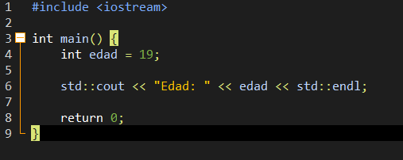
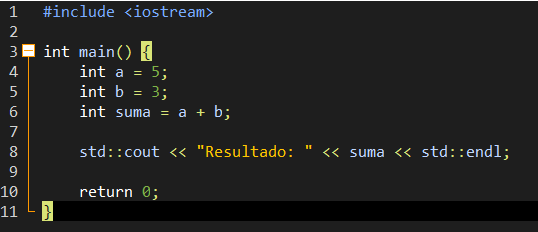
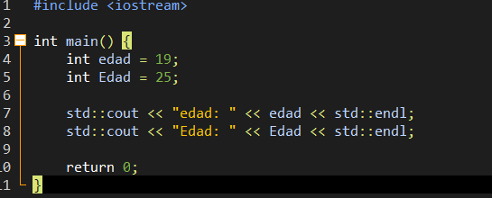
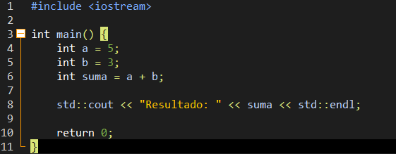

# Práctica - C++ Reference

## Tema
Identifiers en C++

## Nombre
Diego Humberto Ccoyaccoya Huillca

## Descripción
En esta práctica se estudian los identifiers en C++, los cuales son fundamentales en la programación porque permiten nombrar variables, funciones, clases y otros elementos dentro de un programa.

Se analizan sus reglas de construcción, sus características principales y su funcionamiento dentro del lenguaje. Además, se presentan ejemplos que permiten comprender cómo se utilizan los identifiers en situaciones reales de programación.

## Desarrollo de la práctica

### Definición
Los identifiers son nombres que se utilizan en C++ para variables, funciones, clases y otros elementos del programa.

### Reglas
- No pueden empezar con números
- No pueden tener espacios
- No pueden usar símbolos especiales
- No pueden ser palabras reservadas

### Características
- Son sensibles a mayúsculas y minúsculas
- Pueden tener diferentes longitudes
- Cada carácter es significativo

---

## Ejercicios / Ejemplos

Ejemplo 1:
Se declara una variable con un identifier válido.

Ejemplo 2:
Se muestra el uso de identifiers en una operación.

Ejemplo 3:
Se observa la diferencia entre mayúsculas y minúsculas en identifiers.

## Captura del programa

## Archivo PDF
https://doc-00-6o-apps-viewer.googleusercontent.com/viewer/secure/pdf/ibmbvgludtsd3ptgf3n38eut1qvca0v5/016lebbrn5vt2hl5nsc4gt2bl91ogppg/1776618525000/drive/08220957579491000971/ACFrOgCYZ_IWCOZgXs_i6upaNqPWtREANZ8lMPtU-XGsOMXNddrR5S-Rc1MKC0-9cwYj8KausxHweUHSNAROJ1RZDqGS3A5AgwCLooCIM3Xzkt4H4JIIXOA4twcEVjrzHnEH5UEKIslN5tuRbNLEFypbk9EOFm6X3yyidNdiSbtaqbwgDNH-phTN9sHKXAdAiqzQAWkXDQqwoeXLHERbVA-bOc_XFDwnj8Xod6708UBIFuf5Y1wN-qAa_5NbR9U=?print=true&nonce=ht9o838ojs668&user=08220957579491000971&hash=su14hd1f9o8unkvncv4g3q99b64id1db

---

## Rúbrica
| **CPPReference** | Revisar la documentación oficial y otros | 5 |

| **Ejercicios** | Elaborar diferentes ejercicios para facilitar su comprensión | 4 |

| **Informe** | Elaborar un informe detallado en README.md y en formato PDF | 5 |

| **Exposición** | Expone el tema de forma clara, completa e interactiva | 5 |

| **Prueba[^2]** | Se tomaron en cuenta todas las consideraciones y recomendaciones, lo que evidencia un trabajo en equipo | -0 |

|  | **Total** | **20** |

Si el docente solicita un video, debe cargarse en Youtube o Drive y sólo debe entregarse la URL pública, sin que se solicite login alguno. Es recomendable incluir la URL tanto en el README.md como en el informe.
